# Aegis Forge Shared Dependency Map

**Date**: July 26, 2026  
**Architect**: Principal Systems Architect  

---

## 1. Package & Library Dependencies

```mermaid
graph TD
    subgraph Frontend & Clients
        Web["apps/web (Next.js 15 + Three.js)"]
        ChromeExt["apps/chrome-extension"]
        TSSDK["packages/aegisagent-sdk"]
    end

    subgraph Core Packages & DB
        Core["packages/aegis-core (TypeScript Types/Zod)"]
        DB["packages/db (Drizzle ORM / PostgreSQL)"]
    end

    subgraph Go Services & Libs
        ControlPlane["services/control-plane (Go API Gateway)"]
        SandboxMgr["services/sandbox-manager (gVisor)"]
        GoSDK["libs/aegisagent (Go SDK)"]
        CanarySDK["libs/canary-sdk (Go HMAC Canaries)"]
        RoEVal["libs/roe-validator (Go RoE Checker)"]
        GraphClient["libs/graph-client (Neo4j Cypher)"]
    end

    subgraph Python AI Microservices
        AttackGen["services/attack-generator (Claude 3.5)"]
        Evaluator["services/evaluator-agent (GPT-4o)"]
        AnalysisEng["services/analysis-engine (FAIR-AI)"]
        Remediation["services/remediation-agent (Auto-PR)"]
    end

    subgraph Data Stores & Brokers
        Postgres[(PostgreSQL 16)]
        Neo4j[(Neo4j Graph DB)]
        ClickHouse[(ClickHouse Telemetry)]
        Redpanda[(Redpanda / Kafka)]
        Vault[(HashiCorp Vault)]
    end

    TSSDK --> Core
    TSSDK --> ControlPlane
    Web --> DB
    Web --> ControlPlane
    
    ControlPlane --> Postgres
    ControlPlane --> Redpanda
    ControlPlane --> Vault
    ControlPlane --> RoEVal

    SandboxMgr --> CanarySDK
    AttackGen --> Evaluator
    Evaluator --> CanarySDK
    AnalysisEng --> Neo4j
    AnalysisEng --> GraphClient
    GoSDK --> ClickHouse
    GoSDK --> Vault
```

---

## 2. API Contract & Protocol Mapping

| Caller | Provider | Protocol | Payload / Contract | Purpose |
|---|---|---|---|---|
| Target Agent | `ControlPlane` | HTTP REST | `/api/v1/proxy` | Request single-use execution capability token |
| Target Agent | `ControlPlane` | HTTP REST | `/api/v1/execute` | Consume token and forward authorized tool call |
| `ControlPlane` | `SandboxMgr` | HTTP / gRPC | `/sandboxes` | Provision gVisor container for campaign test |
| `ControlPlane` | `AttackGen` | HTTP REST | `/generate` | Synthesize mutated adversarial payload |
| `SandboxMgr` | `Evaluator` | HTTP REST | `/evaluate` | Judge sandbox log, canary breaches, and output |
| `Evaluator` | `AnalysisEng` | HTTP REST | `/analyze` | Compute FAIR-AI quantitative risk score |
| `AnalysisEng` | `Remediation` | HTTP REST | `/remediate` | Propose defensive Sentinel policy & patch |
| `ControlPlane` | `apps/web` | WebSocket / SSE | `/campaigns/{id}/stream` | Stream real-time telemetry to 3D Anatomy canvas |
